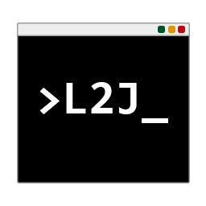

# Welcome to L2J Server CLI tool

Existing commands

- code: gets the source code from the repository
- build: builds the source code
- deploy: deploys the built source code
- account
  - create: creates an account
  - update: updates an account
  - list: list the accounts
  - delete: deletes the account
- quit: exits the CLI